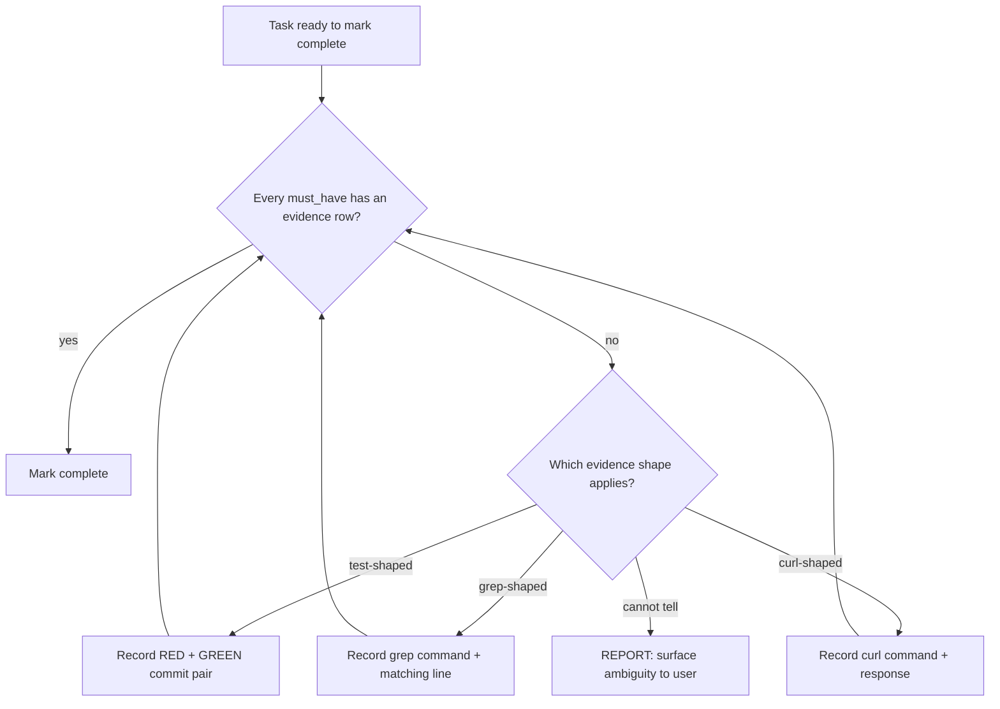

# 12 — Authoring Conventions

**Section type**: declarative contract. Host implementations MUST
satisfy the requirements below. Prose, formatting, and file paths are
at the host's discretion. The keywords MUST, MUST NOT, SHOULD, SHOULD
NOT, and MAY are used per [RFC 2119](https://www.rfc-editor.org/rfc/rfc2119).

## Concept

This section governs how host SKILL.md / AGENTS.md / equivalent
instruction files and contract spec files are *authored*. The
discipline it codifies is: branches go in diagrams, judgment goes in
prose, and behavior-critical text should not be buried.

The motivation is empirical. Workflow-guided planning evaluations on
GPT-class models show that workflows formatted as flowcharts are
followed more reliably than equivalent prose, and that combining text,
code, and flowchart out-performs any single format across a broad
benchmark of agentic scenarios (Xiao et al., *FlowBench: Revisiting
and Benchmarking Workflow-Guided Planning for LLM Agents*, EMNLP 2024
Findings, arXiv:2406.14884). Separately, models systematically
underweight content placed in the middle of long contexts and prefer
content at the beginning or end (Liu et al., *Lost in the Middle: How
Language Models Use Long Contexts*, arXiv:2307.03172). Together these
findings imply two complementary obligations: convert branchy prose to
diagrams where the diagram answers "what next," and keep
behavior-critical prose where the model is likely to read it.

## Requirements

### Branchy workflows

A *branchy workflow* is any passage in a host instruction file or in
this spec that describes a decision the agent must make at runtime,
where:

- there are two or more decision branches, AND
- at least one branch is a cycle (the agent loops back to a prior
  step) or a fallback path (the agent reroutes when a precondition
  fails).

For every branchy workflow:

- A host implementation **SHOULD** render the decision shape as a
  Mermaid `flowchart` (or equivalent diagram syntax the host runtime
  supports) with explicit branches labelled by the condition that
  selects them, and with any cycle or fallback path drawn as an arrow.
- The diagram **SHOULD** name a terminal node for every observable
  outcome, including failure outcomes — at minimum, a `REPORT` node
  for "the agent cannot determine the next step and must surface the
  ambiguity to the user."
- The diagram **MUST NOT** elide a branch the prose mentions. The
  diagram is the canonical form once the section ships in diagram form;
  prose-only fallbacks documented elsewhere are non-conformant.

### Judgment-heavy prose

A *judgment-heavy passage* is one where the right next step depends on
context the diagram cannot capture (taste, severity, stakeholder
considerations, ambiguous trade-offs).

For every judgment-heavy passage:

- A host implementation **SHOULD** keep the passage in prose. The
  diagram answers "what next" but not "why this one"; collapsing
  judgment into a flowchart hides the criteria from the reader and
  invites the agent to treat the chosen branch as mechanical.
- A host implementation **SHOULD NOT** replace judgment-heavy prose
  with a multi-row decision table when the rows do not actually
  decompose the judgment — a table that hides the same prose inside
  cells is worse than the prose, because the table format implies
  exhaustiveness it does not deliver.

### Combined sections

For a section with both branchy logic and judgment:

- A host implementation **MAY** combine a Mermaid diagram and prose
  within a single section. The FlowBench finding is that text + code +
  flowchart together outperforms any single format; this contract
  permits and encourages the combination.
- When combining, the diagram **SHOULD** carry the decision skeleton
  and the prose **SHOULD** carry the criteria the diagram cannot
  encode. Duplicating the prose's content inside the diagram (every
  diagram node restating the prose) defeats the separation.

### Placement of behavior-critical prose (advisory)

This requirement is advisory, lower-case "should." It is not RFC 2119
and not a conformance gate, but host implementations are encouraged to
honor it.

Long prose paragraphs critical to runtime behavior should appear early
in their containing file or be repeated near the decision point where
the model needs them, because models systematically underweight
content buried in the middle of long contexts (Liu et al., 2023).
Practical applications:

- The §11 canonical block lives near the top of CLAUDE.md / AGENTS.md /
  equivalent — not appended below long appendices.
- A section that the agent must re-read at runtime (e.g. the
  rationalization table from §03, the red flags from §04) is either
  near the top or duplicated near the decision point.
- Long auxiliary discussion (provenance, history, alternatives
  rejected) lives near the bottom or in an ADR, where its mid-context
  position is acceptable because re-reading it at runtime is not
  required.

## Illustrative example (non-normative)

The following before/after is illustrative; it is not a normative
fragment of this spec. It demonstrates the conversion shape for a
typical verification-gate passage.

### Before — prose only

> Before marking a task complete, verify each `must_have` row in
> VERIFICATION.md has at least one on-disk evidence row. If the
> must_have is test-shaped, the evidence is a RED + GREEN commit pair.
> If the must_have is grep-shaped, the evidence is a grep command and
> the matching line. If the must_have is curl-shaped, the evidence is
> the full curl command and the response. If no evidence exists,
> produce evidence using the host's verification skill and recheck. If
> no evidence shape applies, surface the ambiguity to the user.

### After — diagram + retained prose

Retained prose: "Evidence shape selection follows §06. A `must_have`
that names an automated test takes RED + GREEN; a `must_have` that
names a file invariant takes a grep result; a `must_have` that names a
runtime behavior takes a curl response or screenshot. The
`cannot tell` branch is rare and indicates a `must_have` row that was
underspecified at planning time."

The diagram carries the routing skeleton — including the cycle (the
three "Record …" nodes return to `check`) and the `REPORT` fallback —
that the prose previously described in sentence form. The prose
retains the criteria (how to pick a shape; what to do when ambiguity
arises) that the diagram cannot encode.

## Conformance

A host implementation claiming conformance with spec version 0.4.0:

- **MUST** satisfy the "Branchy workflows" SHOULD-level convention in
  every host SKILL.md, AGENTS.md, or contract spec file it newly
  authors at or after 0.4.0 adoption. Existing files MAY be converted
  opportunistically at the host's next significant rewrite — bulk
  conversion is not required.
- **MUST NOT** strip judgment-heavy prose in favor of a diagram that
  does not encode the criteria.
- **SHOULD** apply the placement advisory to behavior-critical prose
  in its primary project-instruction file.
- **MAY** define host-specific diagram syntaxes when the host runtime
  does not render Mermaid. The contract is the decision shape made
  explicit, not the specific syntax.

A host that ships a new branchy workflow as prose-only at or after
0.4.0 is non-conformant against this section's SHOULD, but is not
non-conformant against the overall spec — SHOULD-level requirements
move the host above the minimum bar but do not break conformance.

## References

- Xiao, R., Ma, W., Wang, K., Wu, Y., Zhao, J., Wang, H., Jiao, F.,
  Sha, L. *FlowBench: Revisiting and Benchmarking Workflow-Guided
  Planning for LLM Agents.* Findings of EMNLP 2024.
  arXiv:2406.14884.
- Liu, N. F., Lin, K., Hewitt, J., Paranjape, A., Bevilacqua, M.,
  Petroni, F., Liang, P. *Lost in the Middle: How Language Models Use
  Long Contexts.* arXiv:2307.03172. (Published in TACL 2024.)
