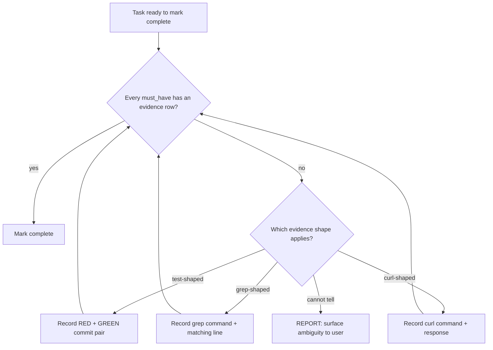

# 12 — Authoring Conventions

**Section type**: declarative contract. Host implementations MUST
satisfy the requirements below. Prose, formatting, and file paths are
at the host's discretion. The keywords MUST, MUST NOT, SHOULD, SHOULD
NOT, and MAY are used per [RFC 2119](https://www.rfc-editor.org/rfc/rfc2119).

## Concept

This section governs how host SKILL.md / AGENTS.md / equivalent
instruction files and contract spec files are *authored*. The
discipline it codifies is: branches go in diagrams, judgment goes in
prose, and behavior-critical text should not be buried.

The motivation is empirical. Workflow-guided planning evaluations on
GPT-class models show that workflows formatted as flowcharts are
followed more reliably than equivalent prose, and that combining text,
code, and flowchart out-performs any single format across a broad
benchmark of agentic scenarios (Xiao et al., *FlowBench: Revisiting
and Benchmarking Workflow-Guided Planning for LLM Agents*, EMNLP 2024
Findings, arXiv:2406.14884). Separately, models systematically
underweight content placed in the middle of long contexts and prefer
content at the beginning or end (Liu et al., *Lost in the Middle: How
Language Models Use Long Contexts*, arXiv:2307.03172). Together these
findings imply two complementary obligations: convert branchy prose to
diagrams where the diagram answers "what next," and keep
behavior-critical prose where the model is likely to read it.

## Requirements

### Branchy workflows

A *branchy workflow* is any passage in a host instruction file or in
this spec that describes a decision the agent must make at runtime,
where:

- there are two or more decision branches, AND
- at least one branch is a cycle (the agent loops back to a prior
  step) or a fallback path (the agent reroutes when a precondition
  fails).

For every branchy workflow:

- A host implementation **SHOULD** render the decision shape as a
  Mermaid `flowchart` (or equivalent diagram syntax the host runtime
  supports) with explicit branches labelled by the condition that
  selects them, and with any cycle or fallback path drawn as an arrow.
- The diagram **SHOULD** name a terminal node for every observable
  outcome, including failure outcomes — at minimum, a `REPORT` node
  for "the agent cannot determine the next step and must surface the
  ambiguity to the user."
- The diagram **MUST NOT** elide a branch the prose mentions. The
  diagram is the canonical form once the section ships in diagram form;
  prose-only fallbacks documented elsewhere are non-conformant.

### Judgment-heavy prose

A *judgment-heavy passage* is one where the right next step depends on
context the diagram cannot capture (taste, severity, stakeholder
considerations, ambiguous trade-offs).

For every judgment-heavy passage:

- A host implementation **SHOULD** keep the passage in prose. The
  diagram answers "what next" but not "why this one"; collapsing
  judgment into a flowchart hides the criteria from the reader and
  invites the agent to treat the chosen branch as mechanical.
- A host implementation **SHOULD NOT** replace judgment-heavy prose
  with a multi-row decision table when the rows do not actually
  decompose the judgment — a table that hides the same prose inside
  cells is worse than the prose, because the table format implies
  exhaustiveness it does not deliver.

### Combined sections

For a section with both branchy logic and judgment:

- A host implementation **MAY** combine a Mermaid diagram and prose
  within a single section. The FlowBench finding is that text + code +
  flowchart together outperforms any single format; this contract
  permits and encourages the combination.
- When combining, the diagram **SHOULD** carry the decision skeleton
  and the prose **SHOULD** carry the criteria the diagram cannot
  encode. Duplicating the prose's content inside the diagram (every
  diagram node restating the prose) defeats the separation.

### Placement of behavior-critical prose (advisory)

This requirement is advisory, lower-case "should." It is not RFC 2119
and not a conformance gate, but host implementations are encouraged to
honor it.

Long prose paragraphs critical to runtime behavior should appear early
in their containing file or be repeated near the decision point where
the model needs them, because models systematically underweight
content buried in the middle of long contexts (Liu et al., 2023).
Practical applications:

- The §11 canonical block lives near the top of CLAUDE.md / AGENTS.md /
  equivalent — not appended below long appendices.
- A section that the agent must re-read at runtime (e.g. the
  rationalization table from §03, the red flags from §04) is either
  near the top or duplicated near the decision point.
- Long auxiliary discussion (provenance, history, alternatives
  rejected) lives near the bottom or in an ADR, where its mid-context
  position is acceptable because re-reading it at runtime is not
  required.

### Instruction-surface economy (eager vs lazy)

The placement advisory above governs *ordering* within the
always-loaded file. This requirement governs *membership*: what belongs
in that file at all.

A host's always-loaded instruction file — the file the runtime injects
on every turn, e.g. `CLAUDE.md` / `AGENTS.md` — is the most expensive
real estate in the workflow. Its entire content is paid on every turn,
whether or not the turn touches code. Minimal hosts feel this most.

A host implementation **SHOULD** keep the always-loaded file to the
minimum that must be resident on *every* turn:

- the §11 canonical block, verbatim and near the top per the placement
  advisory, and
- a short pointer to the trigger skill that carries the rest.

A host implementation **SHOULD** place procedural and reference content
that is only needed once a code task is underway in the lazily-loaded
trigger skill (`SKILL.md` or equivalent) or in a workflow-config, not
in the always-loaded file. This includes the §02 gate-binding table,
task-size routing, the session-handoff
procedure, and gate-procedure prose such as a plan-review runbook. A
host whose runtime enforces a gate programmatically keeps the *hook
wiring* wherever the runtime requires it — only the explanatory prose
moves.

The commitment ritual (§01), the rationalization table (§03), and the
red flags (§04) **MAY** live in the trigger skill, since that skill
loads on exactly the code-touching turns where those blocks bind. A
host **MAY** keep them eager instead if it judges the per-turn budget
affordable.

Rationale: models underweight mid-context content (Liu et al., 2023),
and every eager token is re-billed per turn. A lean always-loaded file
both cuts that recurring cost and keeps the §11 block prominent rather
than buried among procedure. `claude-workflow`'s `CLAUDE.md` — §11 plus
a trigger-skill pointer, with the gate table, routing, ritual tail, and
session-handoff procedure in `skill/SKILL.md` — is the reference shape.

### Shared instruction files across hosts

The economy requirement above governs what belongs in an always-loaded
file. This requirement governs a property that only appears once a
project has more than one agent: `AGENTS.md` is read by *every* agent
that opens the repo, and each host's setup skill has historically
appended to it without looking to see whether another host already had.

This applies to the shared instruction file — `AGENTS.md` or a host
runtime's equivalent shared file. It does **not** apply to `CLAUDE.md`;
see "The Claude file is out of scope" below.

**One section, whatever the agent count.** A project's shared
instruction file **MUST** carry at most one AgenticApps workflow
section, regardless of how many agents are provisioned. The section
**MUST** be host-neutral: it describes the workflow, not the agent
reading it. A second copy is not additional information — it is the
same instruction stated twice, and the two copies drift.

**A host checks before it appends.** A host implementation **MUST**
look for the section marker before writing, and **MUST NOT** append a
second block when one is present. This — not the marker's name — is the
requirement that prevents the duplicate state. All hosts already write
the same host-neutral marker, so two hosts collide precisely because
the name is shared and neither host looks first. It is also why a
duplicate cannot be resolved mechanically: with both blocks carrying an
identical marker, nothing in the file records which host wrote which,
so the provenance needed to choose between them is absent.

**A duplicate is reported, never collapsed.** A tool that finds more
than one section **MUST** report every block found, with its line
range, and **MUST NOT** silently merge or discard any of them. Observed
duplicates had drifted, so merging means choosing between two variants
on evidence the file does not contain.

**Host-specific detail lives in the host's own directory.** Everything
that genuinely differs between agents **MUST** live in that agent's own
directory (`.codex/`, `.opencode/`, `.pi/` or equivalent), not in the
shared file. The measured surface is four values — the host directory,
the binding repo, the invocation syntax for skills and prompts, and the
trigger-skill install root. Content beyond roughly that scope crossing
into a host directory is a signal that something shared has been pushed
somewhere other agents cannot reach it.

**A link per agent is the only host-specific content in the shared
file.** A host implementation **MUST NOT** write host-specific content
into the shared file other than one link per installed agent, pointing
at that agent's own file. The links **MUST** be carried as a
frontmatter list keyed by agent identifier, whose value is the path to
that agent's file:

```yaml
---
agents:
  codex: .codex/AGENTS.md
  pi: .pi/AGENTS.md
---
```

Each value **MUST** be a path. A bare identifier records what is
installed but not where its instructions are, which leaves an agent
reading the shared file with no route to its own.

Because the entries share one frontmatter block, adding or removing an
entry rewrites that block. Another agent's entry being "unchanged"
therefore means its identifier and path are unchanged, not that its
bytes were untouched.

**The section is written once and outlives the agents.** The
host-neutral section **MUST** be written when the first agent is
provisioned and **MUST NOT** be removed when the last agent leaves;
only the departing agent's entry goes. Removal would be symmetric, and
symmetry is the wrong goal: a repo that briefly has no agent would lose
documentation it is about to want back, and re-provisioning would have
to reconstruct prose that was never any agent's to own.

**The section is delimited and machine-removable.** The section
**MUST** be enclosed in begin and end markers, and tooling **MUST** be
able to locate and remove it by those markers alone, without depending
on heading text, ordering, or any wording inside it. Removing the
section **MUST** leave every byte outside the markers unchanged.
Removing two host blocks from a real project was mechanical only
because those hosts happened to write markers; nothing required it, so
nothing guaranteed it for the next host.

**A host identifier inside the section is a warning.** A tool checking
for host neutrality **SHOULD** report a known host identifier found
inside the section body at warning severity, and **MUST NOT** fail on
it. The check is a denylist, so it will both miss novel phrasing and
occasionally fire on prose that merely mentions a host; making a
partial heuristic blocking is the wrong trade. The per-agent links
**MUST** be exempt — they are host-specific by design, and a check that
flagged them would fire on the one thing this requirement permits.

**The Claude file is out of scope.** `CLAUDE.md` is **NOT** subject to
any requirement in this subsection, and the absence of markers in it
**MUST NOT** be reported as a violation. Claude is its only reader, so
there is no second agent to coordinate with and nothing to
deduplicate. A marker convention there would carry cost against no
corresponding failure mode.

## Illustrative example (non-normative)

The following before/after is illustrative; it is not a normative
fragment of this spec. It demonstrates the conversion shape for a
typical verification-gate passage.

### Before — prose only

> Before marking a task complete, verify each `must_have` row in
> VERIFICATION.md has at least one on-disk evidence row. If the
> must_have is test-shaped, the evidence is a RED + GREEN commit pair.
> If the must_have is grep-shaped, the evidence is a grep command and
> the matching line. If the must_have is curl-shaped, the evidence is
> the full curl command and the response. If no evidence exists,
> produce evidence using the host's verification skill and recheck. If
> no evidence shape applies, surface the ambiguity to the user.

### After — diagram + retained prose



Retained prose: "Evidence shape selection follows §06. A `must_have`
that names an automated test takes RED + GREEN; a `must_have` that
names a file invariant takes a grep result; a `must_have` that names a
runtime behavior takes a curl response or screenshot. The
`cannot tell` branch is rare and indicates a `must_have` row that was
underspecified at planning time."

The diagram carries the routing skeleton — including the cycle (the
three "Record …" nodes return to `check`) and the `REPORT` fallback —
that the prose previously described in sentence form. The prose
retains the criteria (how to pick a shape; what to do when ambiguity
arises) that the diagram cannot encode.

## Conformance

A host implementation claiming conformance with spec version 0.11.0:

- **MUST** carry at most one workflow section in the shared instruction
  file, check for the marker before appending, keep host-specific
  detail in the host's own directory, and write no host-specific
  content into the shared file beyond its own frontmatter agent entry
  (see "Shared instruction files across hosts"). These are MUST-level:
  a host that appends a second block is non-conformant against this
  section, not merely below its SHOULDs.
- **MUST** delimit the section with markers that allow it to be located
  and removed without reading its prose, leaving every byte outside the
  markers unchanged.
- **MUST NOT** apply any requirement in that subsection to `CLAUDE.md`,
  or report its lack of markers as a violation.
- **SHOULD** report a known host identifier inside the section body at
  warning severity, exempting the per-agent links, and MUST NOT fail on
  it.
- **MUST** satisfy the "Branchy workflows" SHOULD-level convention in
  every host SKILL.md, AGENTS.md, or contract spec file it newly
  authors at or after 0.4.0 adoption. Existing files MAY be converted
  opportunistically at the host's next significant rewrite — bulk
  conversion is not required.
- **MUST NOT** strip judgment-heavy prose in favor of a diagram that
  does not encode the criteria.
- **SHOULD** apply the placement advisory to behavior-critical prose
  in its primary project-instruction file.
- **SHOULD** keep its always-loaded instruction file to the §11 block
  plus a trigger-skill pointer, placing the §02 gate table, task-size
  routing, session-handoff, and gate-procedure
  prose in the lazily-loaded trigger skill or a workflow-config (see
  "Instruction-surface economy").
- **MAY** define host-specific diagram syntaxes when the host runtime
  does not render Mermaid. The contract is the decision shape made
  explicit, not the specific syntax.

A host that ships a new branchy workflow as prose-only at or after
0.4.0, or that ships a heavy always-loaded instruction file at or after
0.10.0, is non-conformant against this section's SHOULDs, but is not
non-conformant against the overall spec — SHOULD-level requirements
move the host above the minimum bar but do not break conformance.

The shared-instruction-file requirements added at 0.11.0 are the
exception, and are stated as MUSTs deliberately. Their failure mode is
not a host falling below a quality bar on its own surface: a host that
appends a second block damages a file every *other* agent reads, and
the damage is invisible until a second host arrives. A SHOULD would
leave the one rule whose violation is another host's problem
unenforceable.

## References

- Xiao, R., Ma, W., Wang, K., Wu, Y., Zhao, J., Wang, H., Jiao, F.,
  Sha, L. *FlowBench: Revisiting and Benchmarking Workflow-Guided
  Planning for LLM Agents.* Findings of EMNLP 2024.
  arXiv:2406.14884.
- Liu, N. F., Lin, K., Hewitt, J., Paranjape, A., Bevilacqua, M.,
  Petroni, F., Liang, P. *Lost in the Middle: How Language Models Use
  Long Contexts.* arXiv:2307.03172. (Published in TACL 2024.)
